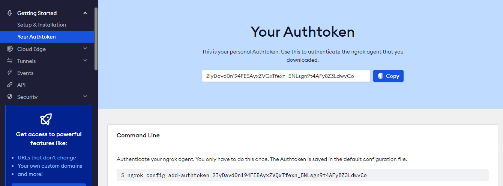

# ProjectSoftwareEngineering
The repository of all team: https://github.com/OdiousFox/ProjectSoftwareEngineering.git
The experiment repository of frontend team: https://github.com/09victor09/09victor09.github.io
Note that the "my_server" folder contains code of backend team, the "PSE_LoPy" contains code of hardware team and the "website source code" contains code of frontend team
Regard to Doxygen, only the backend team has doxygen document since doxygen does not seem to support Javascript, HTML or CSS 
## How to run webserver
The webserver is running using Django framework. Therefore, you need to have python version 3.x to run. Dowload the python interpreter, then you need to create virtual environment in python. Run the following command
```python=
python -m venv "your project folder"
```
For example on Window system
```python=
D:\ACmeasure>python -m venv my_proj
```
New folder named "my_proj" will be created in directory "D:\ACmeasure". Go to "my_proj" directory then go to "Script" then activate "activate.bat" file
```cmd=

D:\ACmeasure>cd my_proj

D:\ACmeasure\my_proj>cd Scripts

D:\ACmeasure\my_proj\Scripts>activate.bat

(my_proj) D:\ACmeasure\my_proj\Scripts>
```
Dowload the zip file then unzip in current folder
```cmd=
(my_proj) D:\ACmeasure\my_proj\Scripts>dir
 Volume in drive D is New Volume
 Volume Serial Number is 707A-06C4

 Directory of D:\ACmeasure\my_proj\Scripts

19/12/2022  02:55    <DIR>          .
19/12/2022  02:55    <DIR>          ..
06/12/2022  12:17             2,066 activate
06/12/2022  12:17               995 activate.bat
06/12/2022  12:17            24,175 Activate.ps1
06/12/2022  12:17               393 deactivate.bat
06/12/2022  12:17           107,886 pip.exe
06/12/2022  12:17           107,886 pip3.10.exe
06/12/2022  12:17           107,886 pip3.exe
19/12/2022  02:55    <DIR>          ProjectSoftwareEngineering-minh
19/12/2022  02:55           129,242 ProjectSoftwareEngineering-minh.zip
06/12/2022  12:17           266,624 python.exe
06/12/2022  12:17           254,848 pythonw.exe
06/12/2022  12:34           107,881 sqlformat.exe
              11 File(s)      1,109,882 bytes
               3 Dir(s)  10,327,334,912 bytes free
```
Remove the zip file then install all required framework by this command
```cmd=
(my_proj) D:\ACmeasure\my_proj\Scripts\ProjectSoftwareEngineering-minh>cd ../
(my_proj) D:\ACmeasure\my_proj\Scripts>python.exe -m pip install -r ProjectSoftwareEngineering-minh/requirements.txt
```
The file requirements.txt contains all framework packages for project including Django, pyngrok, paho-mqtt, etc

On Linux or Mac OS, the process is the same just when you activate virtual environment, you need to run "source bin/activate"
```bash=
minh@DESKTOP-Q7J9KK5:/mnt/d/ACmeasure$ python3 -m venv my_pro
minh@DESKTOP-Q7J9KK5:/mnt/d/ACmeasure$ cd my_pro
minh@DESKTOP-Q7J9KK5:/mnt/d/ACmeasure/my_pro$
minh@DESKTOP-Q7J9KK5:/mnt/d/ACmeasure/my_pro$ source bin/activate
(my_pro) minh@DESKTOP-Q7J9KK5:/mnt/d/ACmeasure/my_pro$
```
after that the process to install and run is same as in the Window.


Now, if you want to run this Django server locally, go to settings.py file. The location of this file is inside ProjectSofware and my_server. Here is the location of it in my folder
```cmd
 Directory of D:\ACmeasure\my_proj\Scripts\ProjectSoftwareEngineering-minh\my_server\my_server

19/12/2022  02:44    <DIR>          .
19/12/2022  02:44    <DIR>          ..
19/12/2022  02:44               411 asgi.py
19/12/2022  02:44             3,696 settings.py
19/12/2022  02:44               830 urls.py
19/12/2022  02:44               411 wsgi.py
19/12/2022  02:44                 0 __init__.py
19/12/2022  02:44    <DIR>          __pycache__
```
Please change variable "USE_NGROK" to value "False" in settings.py
```python
USE_NGROK = False
```
This will disable tunnel using ngrok service to access website from outside network
The run this command to enable Django server
```cmd=
(my_proj) D:\ACmeasure\my_proj\Scripts>python.exe ProjectSoftwareEngineering-minh/my_server/manage.py runserver
Watching for file changes with StatReloader
Performing system checks...

System check identified no issues (0 silenced).
Hello
Connected with result code 0
December 19, 2022 - 03:14:41
Django version 4.1.3, using settings 'my_server.settings'
Starting development server at http://127.0.0.1:8000/
Quit the server with CTRL-BREAK.
```
To get the webpage, please use browser and type in "http://127.0.0.1:8000/webserver/" and to get API, type int "http://127.0.0.1:8000/webserver/api/"

Now to get access this server from outside world, it is necessary to login NGROK service and get your own personal authorized token. Here is link to the website: https://ngrok.com/
Here is what your personal authorized toke looked like:
 
Copy this token and go to apps.py. The apps.py is located in "ProjectSoftwareEngineering-minh\my_server\webserver"
```cmd=
 Directory of D:\ACmeasure\my_proj\Scripts\ProjectSoftwareEngineering-minh\my_server\webserver

19/12/2022  02:44    <DIR>          .
19/12/2022  02:44    <DIR>          ..
19/12/2022  02:44                66 admin.py
19/12/2022  02:44             1,466 apps.py
19/12/2022  02:44    <DIR>          migrations
19/12/2022  02:44             2,475 models.py
19/12/2022  02:44            13,953 mqtt_py.py
19/12/2022  02:44    <DIR>          static
19/12/2022  02:44    <DIR>          template
19/12/2022  02:44                63 tests.py
19/12/2022  02:44               152 urls.py
19/12/2022  02:44             2,182 views.py
19/12/2022  02:44                 0 __init__.py
19/12/2022  03:14    <DIR>          __pycache__
```
In apps.py file please change this
```py
conf.get_default().auth_token = "2IyDavd0n194FE5AyxZVQxTfexn_5NLsgn9t4AFy8Z3LdwvCo"
```
to your personal token, then go to previous settings.py and change variable "USE_NGROK" to value "True"
To run Django server use this command 
```cmd=
(my_proj) D:\ACmeasure\my_proj\Scripts>python.exe ProjectSoftwareEngineering-minh/my_server/manage.py runserver --noreload

```
The result of this command will be 
```

(my_proj) D:\ACmeasure\my_proj\Scripts>python.exe ProjectSoftwareEngineering-minh/my_server/manage.py runserver --noreload
ngrok tunnel "https://cc7f-2001-1c06-180b-b600-1423-1196-53cc-6f7f.eu.ngrok.io" -> "http://127.0.0.1:8000"
Performing system checks...

System check identified no issues (0 silenced).
December 19, 2022 - 03:31:54
Django version 4.1.3, using settings 'my_server.settings'
Starting development server at http://127.0.0.1:8000/
Quit the server with CTRL-BREAK.
Hello
Connected with result code 0
``` 
Note that ngrok tunnel will change randomly whenever you start server, so the hyper link will be different
Now go to the browser and type "https://cc7f-2001-1c06-180b-b600-1423-1196-53cc-6f7f.eu.ngrok.io/webserver/" get webpage or "https://cc7f-2001-1c06-180b-b600-1423-1196-53cc-6f7f.eu.ngrok.io/webserver/api/" to get API
If you want to end the server you need to exit the terminal running server.
